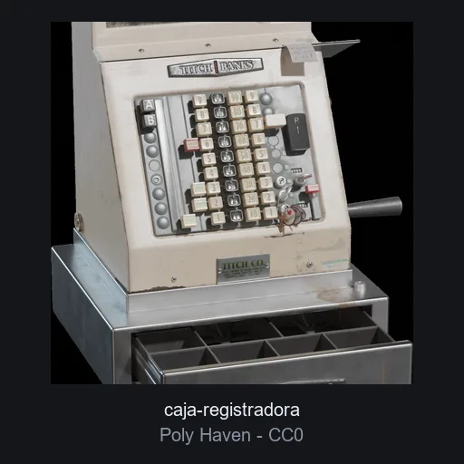

# Caja registradora

**ID:** `caja-registradora` · **Categoria:** comercio · **Tipo:** modelo_glb · **Estado:** ACTIVO

Caja registradora vintage fotorealista (scan PBR 1k, 6 texturas). Ideal para heroes y secciones de comercio, retail y puntos de venta.



## Datos clave

| Campo | Valor |
|-------|-------|
| Fuente | Poly Haven |
| Autor | Joe Seabuhr |
| Licencia | [CC0-1.0](https://polyhaven.com/license) |
| Uso comercial | si |
| Atribucion requerida | no |
| Peso | 1012.8 KB |
| Triangulos | 9927 |
| Vertices | 9276 |
| Texturas | 6 |
| Animaciones | 0 |
| Transparencia | si |
| Nivel de rendimiento | medio |
| Mobile | si |
| Optimizacion | empaquetado_glb |
| Preview | OK |

## Comportamientos compatibles

- `arrastrar_rotar`
- `orbita_zoom`
- `estatico`

> Los comportamientos NO se guardan en el elemento: se aplican al integrarlo
> usando los patrones de la skill `.claude/skills/web-3d/SKILL.md`.

## Uso rapido

```tsx
'use client';

import { useLoader } from '@react-three/fiber';
import { GLTFLoader } from 'three-stdlib';

export function Modelo() {
  const gltf = useLoader(GLTFLoader, '/ruta-al-catalogo/elementos/caja-registradora/modelo.glb');
  return <primitive object={gltf.scene} />;
}
```

El comportamiento (mirar_mouse, arrastrar_rotar, etc.) se aplica por fuera del
modelo con los patrones de la skill `web-3d`.

## Observaciones

Un material usa alphaMode BLEND. glTF 1k empaquetado a GLB unico. Preview: render oficial de Poly Haven (CC0).
