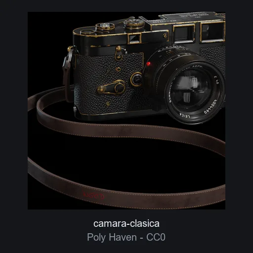

# Camara clasica

**ID:** `camara-clasica` · **Categoria:** producto · **Tipo:** modelo_glb · **Estado:** ACTIVO

Camara telemetrica clasica fotorealista (scan PBR 1k, 9 texturas). Producto estrella para heroes de fotografia, e-commerce de electronica o secciones de portfolio.



## Datos clave

| Campo | Valor |
|-------|-------|
| Fuente | Poly Haven |
| Autor | Rajil Jose Macatangay |
| Licencia | [CC0-1.0](https://polyhaven.com/license) |
| Uso comercial | si |
| Atribucion requerida | no |
| Peso | 2379.1 KB |
| Triangulos | 26987 |
| Vertices | 21347 |
| Texturas | 9 |
| Animaciones | 0 |
| Transparencia | no |
| Nivel de rendimiento | medio |
| Mobile | si |
| Optimizacion | empaquetado_glb |
| Preview | OK |

## Comportamientos compatibles

- `arrastrar_rotar`
- `orbita_zoom`
- `mirar_mouse`
- `estatico`

> Los comportamientos NO se guardan en el elemento: se aplican al integrarlo
> usando los patrones de la skill `.claude/skills/web-3d/SKILL.md`.

## Uso rapido

```tsx
'use client';

import { useLoader } from '@react-three/fiber';
import { GLTFLoader } from 'three-stdlib';

export function Modelo() {
  const gltf = useLoader(GLTFLoader, '/ruta-al-catalogo/elementos/camara-clasica/modelo.glb');
  return <primitive object={gltf.scene} />;
}
```

El comportamiento (mirar_mouse, arrastrar_rotar, etc.) se aplica por fuera del
modelo con los patrones de la skill `web-3d`.

## Observaciones

El modelo reproduce una camara de marca real visible en las texturas; el asset es CC0 (scan de Poly Haven) y su uso es licito, pero conviene difuminar la marca si el cliente es del rubro fotografico. Preview: render oficial de Poly Haven (CC0).
