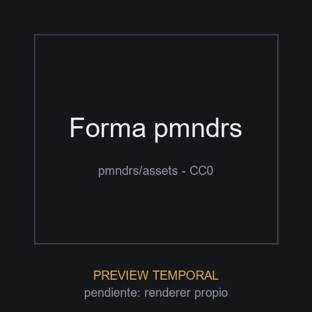

# Forma pmndrs

**ID:** `forma-pmndrs` · **Categoria:** tecnologia · **Tipo:** modelo_glb · **Estado:** ACTIVO

Forma geometrica abstracta (marca de Poimandres) con una textura embebida. Util como elemento tecnologico flotante en heroes y secciones de producto SaaS.



## Datos clave

| Campo | Valor |
|-------|-------|
| Fuente | pmndrs/assets (GitHub) |
| Autor | pmndrs (Poimandres) |
| Licencia | [CC0-1.0](https://github.com/pmndrs/assets/blob/main/LICENSE) |
| Uso comercial | si |
| Atribucion requerida | no |
| Peso | 179.4 KB |
| Triangulos | 2696 |
| Vertices | 1773 |
| Texturas | 1 |
| Animaciones | 0 |
| Transparencia | no |
| Nivel de rendimiento | liviano |
| Mobile | si |
| Optimizacion | original |
| Preview | TEMPORAL |

## Comportamientos compatibles

- `seguir_cursor`
- `mirar_mouse`
- `transformar_scroll`
- `estatico`

> Los comportamientos NO se guardan en el elemento: se aplican al integrarlo
> usando los patrones de la skill `.claude/skills/web-3d/SKILL.md`.

## Uso rapido

```tsx
'use client';

import { useLoader } from '@react-three/fiber';
import { GLTFLoader } from 'three-stdlib';

export function Modelo() {
  const gltf = useLoader(GLTFLoader, '/ruta-al-catalogo/elementos/forma-pmndrs/modelo.glb');
  return <primitive object={gltf.scene} />;
}
```

El comportamiento (mirar_mouse, arrastrar_rotar, etc.) se aplica por fuera del
modelo con los patrones de la skill `web-3d`.

## Observaciones

Es la marca visual de pmndrs: usar como forma abstracta, no para sugerir respaldo del proyecto pmndrs. Preview placeholder generada.
