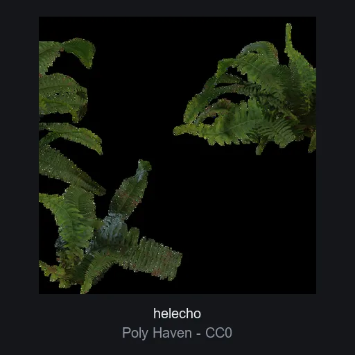

# Helecho

**ID:** `helecho` · **Categoria:** entorno · **Tipo:** modelo_glb · **Estado:** ACTIVO

Helecho fotorealista (scan PBR 1k, 3 texturas, hojas con canal alfa). Pieza de entorno natural para escenas organicas, heroes de wellness y decoracion de secciones.



## Datos clave

| Campo | Valor |
|-------|-------|
| Fuente | Poly Haven |
| Autor | Rob Tuytel, Rico Cilliers |
| Licencia | [CC0-1.0](https://polyhaven.com/license) |
| Uso comercial | si |
| Atribucion requerida | no |
| Peso | 1116.8 KB |
| Triangulos | 6232 |
| Vertices | 4337 |
| Texturas | 3 |
| Animaciones | 0 |
| Transparencia | si |
| Nivel de rendimiento | medio |
| Mobile | si |
| Optimizacion | empaquetado_glb |
| Preview | OK |

## Comportamientos compatibles

- `estatico`
- `transformar_scroll`

> Los comportamientos NO se guardan en el elemento: se aplican al integrarlo
> usando los patrones de la skill `.claude/skills/web-3d/SKILL.md`.

## Uso rapido

```tsx
'use client';

import { useLoader } from '@react-three/fiber';
import { GLTFLoader } from 'three-stdlib';

export function Modelo() {
  const gltf = useLoader(GLTFLoader, '/ruta-al-catalogo/elementos/helecho/modelo.glb');
  return <primitive object={gltf.scene} />;
}
```

El comportamiento (mirar_mouse, arrastrar_rotar, etc.) se aplica por fuera del
modelo con los patrones de la skill `web-3d`.

## Observaciones

Las hojas usan alphaMode (transparencia por textura): requiere alphaTest o render de doble cara en three.js. glTF 1k empaquetado a GLB unico. Preview: render oficial de Poly Haven (CC0).
