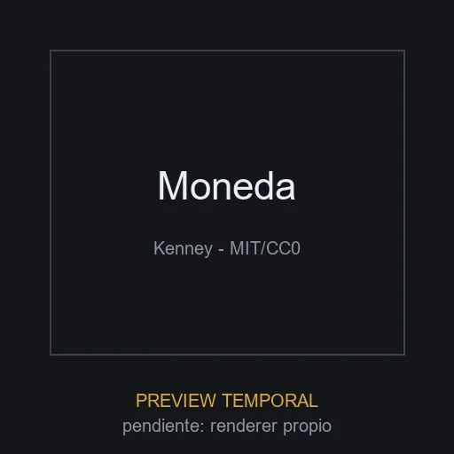

# Moneda

**ID:** `moneda` · **Categoria:** comercio · **Tipo:** modelo_glb · **Estado:** ACTIVO

Moneda low-poly del Starter Kit 3D Platformer de Kenney. Clasico elemento giratorio para e-commerce, fintech, precios y gamificacion.



## Datos clave

| Campo | Valor |
|-------|-------|
| Fuente | KenneyNL/Starter-Kit-3D-Platformer (GitHub) |
| Autor | Kenney (kenney.nl) |
| Licencia | [MIT](https://github.com/KenneyNL/Starter-Kit-3D-Platformer/blob/main/LICENSE) |
| Uso comercial | si |
| Atribucion requerida | no |
| Peso | 21.6 KB |
| Triangulos | 252 |
| Vertices | 392 |
| Texturas | 1 |
| Animaciones | 0 |
| Transparencia | no |
| Nivel de rendimiento | liviano |
| Mobile | si |
| Optimizacion | original |
| Preview | TEMPORAL |

## Comportamientos compatibles

- `seguir_cursor`
- `mirar_mouse`
- `transformar_scroll`
- `estatico`

> Los comportamientos NO se guardan en el elemento: se aplican al integrarlo
> usando los patrones de la skill `.claude/skills/web-3d/SKILL.md`.

## Uso rapido

```tsx
'use client';

import { useLoader } from '@react-three/fiber';
import { GLTFLoader } from 'three-stdlib';

export function Modelo() {
  const gltf = useLoader(GLTFLoader, '/ruta-al-catalogo/elementos/moneda/modelo.glb');
  return <primitive object={gltf.scene} />;
}
```

El comportamiento (mirar_mouse, arrastrar_rotar, etc.) se aplica por fuera del
modelo con los patrones de la skill `web-3d`.

## Observaciones

Repo GitHub bajo MIT (verificado via API de GitHub). Preview placeholder generada.
