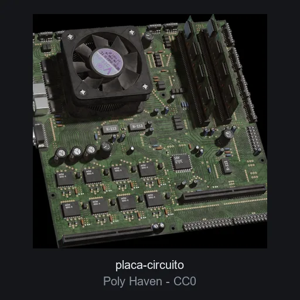

# Placa de circuito

**ID:** `placa-circuito` · **Categoria:** tecnologia · **Tipo:** modelo_glb · **Estado:** ACTIVO

Placa de circuito impreso fotorealista (scan PBR 1k) con 4 texturas. Pieza tecnologica para heroes de hardware, IoT o servicios de electronica.



## Datos clave

| Campo | Valor |
|-------|-------|
| Fuente | Poly Haven |
| Autor | Benny Weimer |
| Licencia | [CC0-1.0](https://polyhaven.com/license) |
| Uso comercial | si |
| Atribucion requerida | no |
| Peso | 4045.8 KB |
| Triangulos | 14430 |
| Vertices | 18273 |
| Texturas | 4 |
| Animaciones | 0 |
| Transparencia | si |
| Nivel de rendimiento | pesado |
| Mobile | no |
| Optimizacion | empaquetado_glb |
| Preview | OK |

## Comportamientos compatibles

- `estatico`
- `transformar_scroll`
- `orbita_zoom`

> Los comportamientos NO se guardan en el elemento: se aplican al integrarlo
> usando los patrones de la skill `.claude/skills/web-3d/SKILL.md`.

## Uso rapido

```tsx
'use client';

import { useLoader } from '@react-three/fiber';
import { GLTFLoader } from 'three-stdlib';

export function Modelo() {
  const gltf = useLoader(GLTFLoader, '/ruta-al-catalogo/elementos/placa-circuito/modelo.glb');
  return <primitive object={gltf.scene} />;
}
```

El comportamiento (mirar_mouse, arrastrar_rotar, etc.) se aplica por fuera del
modelo con los patrones de la skill `web-3d`.

## Observaciones

3.95 MiB: por debajo del limite de 4 MiB pero sin margen; si el limite se interpreta como 4 MB decimales excede por ~139 KB y seria candidato a reoptimizacion (Draco/KTX2) en el lote 2. glTF 1k empaquetado a GLB unico con script propio, sin decimar. Un material usa alphaMode BLEND. Preview: render oficial de Poly Haven (CC0) compuesto sobre fondo neutro.
