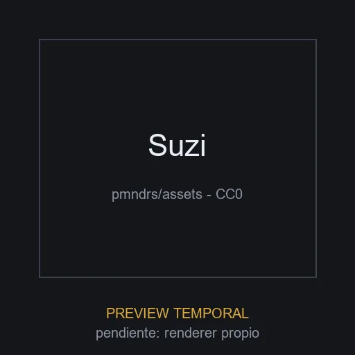

# Suzi

**ID:** `suzi` · **Categoria:** abstracto · **Tipo:** modelo_glb · **Estado:** ACTIVO

Cabeza de mono iconica del 3D (derivada de Suzanne de Blender), distribuida en pmndrs/assets. Pieza tecnologica/abstracta para heroes, fondos interactivos y demos de iluminacion.



## Datos clave

| Campo | Valor |
|-------|-------|
| Fuente | pmndrs/assets (GitHub) |
| Autor | pmndrs (Poimandres); derivada de Suzanne (Blender) |
| Licencia | [CC0-1.0](https://github.com/pmndrs/assets/blob/main/LICENSE) |
| Uso comercial | si |
| Atribucion requerida | no |
| Peso | 346.4 KB |
| Triangulos | 15744 |
| Vertices | 8098 |
| Texturas | 0 |
| Animaciones | 0 |
| Transparencia | no |
| Nivel de rendimiento | liviano |
| Mobile | si |
| Optimizacion | original |
| Preview | TEMPORAL |

## Comportamientos compatibles

- `mirar_mouse`
- `arrastrar_rotar`
- `orbita_zoom`
- `transformar_scroll`
- `estatico`

> Los comportamientos NO se guardan en el elemento: se aplican al integrarlo
> usando los patrones de la skill `.claude/skills/web-3d/SKILL.md`.

## Uso rapido

```tsx
'use client';

import { useLoader } from '@react-three/fiber';
import { GLTFLoader } from 'three-stdlib';

export function Modelo() {
  const gltf = useLoader(GLTFLoader, '/ruta-al-catalogo/elementos/suzi/modelo.glb');
  return <primitive object={gltf.scene} />;
}
```

El comportamiento (mirar_mouse, arrastrar_rotar, etc.) se aplica por fuera del
modelo con los patrones de la skill `web-3d`.

## Observaciones

Sin texturas: el aspecto final depende del material asignado. Preview placeholder generada; pendiente renderer propio.
