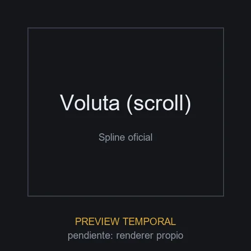

# Voluta (transiciones por scroll)

**ID:** `voluta-scroll` · **Categoria:** escena_spline · **Tipo:** referencia_remota · **Estado:** ACTIVO

Escena oficial de Spline con transiciones y estados de camara controlados por scroll. Composicion lista para heroes con narrativa visual y portfolios cinematograficos.



## Datos clave

| Campo | Valor |
|-------|-------|
| Fuente | Spline (escena oficial de la documentacion, via skill web-3d) |
| Autor | Spline, Inc. |
| Licencia | [Uso libre (escena oficial publicada por Spline para embed directo)](https://docs.spline.design/) |
| Uso comercial | si |
| Atribucion requerida | no |
| Peso | 0.3 KB |
| Triangulos | n/a |
| Vertices | n/a |
| Texturas | n/a |
| Animaciones | n/a |
| Transparencia | n/a |
| Nivel de rendimiento | n/a (escena remota) |
| Mobile | si |
| Optimizacion | remota_no_aplica |
| Preview | TEMPORAL |

## Comportamientos compatibles

- `transformar_scroll`

> Los comportamientos NO se guardan en el elemento: se aplican al integrarlo
> usando los patrones de la skill `.claude/skills/web-3d/SKILL.md`.

## Uso rapido

```html
<script type="module" src="https://unpkg.com/@splinetool/viewer/build/spline-viewer.js"></script>
<spline-viewer url="https://prod.spline.design/LEvjG3OETYd2GsRw/scene.splinecode"></spline-viewer>
```

La URL publica esta en `escena.json`. Integracion Next.js: ver skill `web-3d`.

## Observaciones

La escena vive en el CDN de Spline; el repo solo guarda la URL publica en escena.json (no se copia el .splinecode). Es una `referencia_remota`, no un asset redistribuible. Spline no etiqueta licencias en su seccion Community, por lo que se eligieron escenas oficiales de su documentacion con licencia verificable. Las condiciones de embed/uso estan en `escena.json` (campo `condiciones_embed`). Metricas geometricas no aplican (escena remota). Preview placeholder generada.
